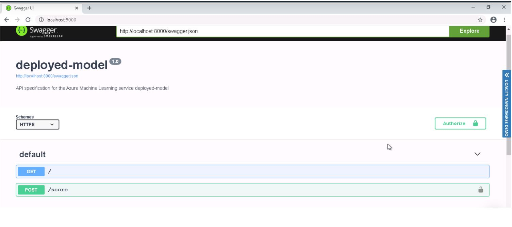
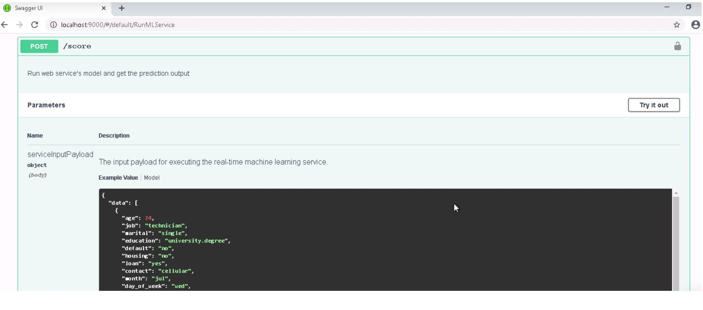
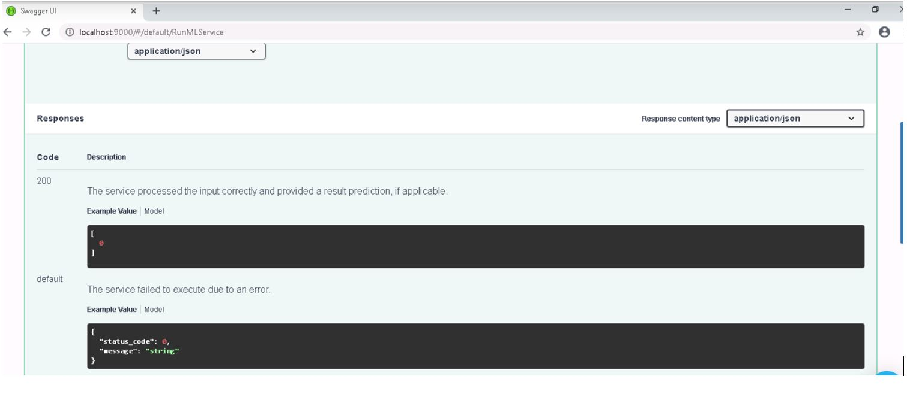

# Project Overview
In this project we setup the AutoML experiment on Bankmarketing dataset. Its Binary classification task to predict the potential customer response. AutoML experiment has been configured with the Exit Criteria and compute target. 
After experiment completion best trained model which score highest on Accuracy metric is selected for deployment to ACS. 

On deployed model logging is enabled by setting enable_application_insight=True. This generates logs while consuming deployed model through http API request/response. Swagger tool is used for endpoint documentation. First the docker image for SwaggerUI is pulled and then docker container service is configured on port. Serve.py script is run to start http service to show Swagger JSON file content. 

Deployed model is consumed by using http API request and response is returned in the JSON data format.Finally pipleline is created to setup and run AutoML experiment and later published with best trained model showing the Rest Endpoint and a status of Active. 

## Architectural Diagram

Below workflow depicts various configurations for AutoML experiment including Dataset, Optimization metric and time/cost constraint. 


Below workflow depicts Deployment pipeline using Docker image as computer target.


## How to improve the project
1. AutoML experiment can be configured to run longer and early termination criteria can be enabled to allow experiment to run until primary metric score stops improving past n iterations. 
2. To expedite the training process, compute target of CPU cluster can be replaced with GPU cluster. This would speed up AutoML experiment completion if training time is constrain. 
3. For making model Production ready we need high-scale production deployments which provides fast response time and autoscaling of the deployed service. Its supported by AKS (Azure Kubernetes Service). So compute target for deployment can be changed from ACS to AKS. 
4. Model can be converted into ONNX format and deployed on Edge device if runing deployment service on cloud instance is expensive or there is lot of latency involved.    

## Auto ML Experiment

  - Screenshot of Registered Dataset in ML Studio: 
    

  - Screenshot showing Experiment is completed:
    

  - Screenshot of Best Model from experiment:
    
    
    
## Deploy the Best Model

  - Screenshot showing best Deployed Model:
    

## Enable Logging

  - Screenshot showing "Application Insight" is enabled in details tab of the endpoint:
     

  - Screenshot showing logs by running the provided logs.py script: 
     

## Swagger Documentation

  - Screenshot showing swagger runs on localhost showing http API methods and response for the model: 
    
    
    


    Steps to run swagger UI are listed below. 
    1. Download the swagger.json inside swagger folder where swagger.sh and serve.py files are located. 
    2. Run the swagger.sh bash file using command ```bash swagger.sh``` to run Swagger UI container on port 9000:8080. 
    3. Run the http://localhost:9000 on new browser to launch default swagger page. 
    4. Run the python script file ```python serve.py``` to run the content of directory where swagger.json is present on http server port 8000. 
    5. Go back to running swagger instance and type http://locahost:8000/swagger.json. 
    6. On swagger documentation, deployed model API can be seen GET and POST. On expanding POST/score it further shows what JSON data format is expected. 
  
 

## Consume Model Endpoints

  - Screenshot showing endpoint.py scripts run against the API producing JSON output from the model:
     

## Create and Publish a Pipeline

  - Screenshot of pipeline section of the Azure ML Studio showing pipeline has been created:
    
      

  - Screenshot of pipeline section of the Azure ML Studio showing pipleline endpoints: 
     

  - Screenshot showing Bankmarketing dataset with the AutoML module:
     

  - Screenshot of "Published pipleline overview" showing Rest endpoint and status of Active:
      

  - Screenshot of Jupyter notebook showing "Use Runs Widget" with step runs:
     


## Screencast video link
   Attached link to screenshot summarizes all steps completed in this project. 
   https://youtu.be/vlzcMSxXPo4